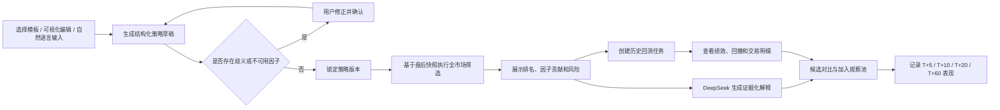

# AI 智能选股工具产品需求文档（PRD）

| 项目 | 内容 |
| --- | --- |
| 文档版本 | V1.0 |
| 文档状态 | 评审稿 |
| 更新日期 | 2026-08-07 |
| 产品阶段 | MVP |
| 目标用户 | 内部投研人员、策略研究员、投研负责人、数据管理员 |
| 覆盖资产 | A 股个股、境内交易所挂牌 ETF |
| 研究周期 | 盘后研究，预期持有 5–60 个交易日 |
| 数据事实源 | Tushare Pro |
| AI 模型 | DeepSeek `deepseek-v4-flash` |

> 本产品用于内部量化研究和候选标的发现，不构成投资建议、收益承诺或交易指令。历史回测结果不代表未来表现。

## 1. 文档目的

本文档定义一款独立的 AI 智能选股研究工具，描述其产品定位、用户流程、功能需求、数据口径、策略与因子体系、AI 边界、回测规则、业务对象、验收标准和风险控制。

本文档不涉及已有项目的配置调整、页面重构、接口改造、技术选型迁移或代码兼容方案。未来如需将本产品接入任何既有系统，应另行编制技术方案和集成设计。

## 2. 背景与机会

内部投研选股通常存在以下问题：

1. 研究条件分散在自然语言、表格和个人脚本中，难以复用和审计。
2. 股票与 ETF 经常共用一套筛选逻辑，忽略资产属性、估值口径和交易规则差异。
3. 大模型生成的选股结论若没有结构化规则和数据证据，难以验证，也容易出现幻觉。
4. 筛选与回测脱节，研究员无法快速判断因子在不同市场阶段的有效性和稳定性。
5. Tushare 接口存在积分、频率和字段覆盖差异，权限不足时容易产生静默缺数或错误估算。
6. 历史回测容易误用当前股票池、报告期数据或当日收盘价，形成幸存者偏差和未来函数。

本产品采用“确定性规则引擎为主、AI 为可审计辅助”的设计：先将研究意图转换为可确认的结构化策略，再基于 Tushare 盘后快照执行全市场筛选和历史回测，最后由 AI 对真实因子值进行解释。AI 不生成事实、不绕过硬过滤条件，也不直接发出买卖指令。

## 3. 产品定位

### 3.1 产品愿景

让内部投研人员无需编写代码，也能把投资假设快速转化为可复用、可回测、可解释、可审计的 A 股和 ETF 筛选策略。

### 3.2 核心价值

- **高效表达**：自然语言、内置模板和可视化条件编辑器统一落为结构化策略。
- **结果可信**：筛选排名完全由确定性数据与规则生成，AI 仅解释已有证据。
- **过程可审计**：策略、因子、数据快照、模型和交易成本均保存版本。
- **回测严谨**：按数据当时可见性、真实证券生命周期和交易限制执行。
- **资产适配**：股票与不同类别 ETF 使用独立因子兼容矩阵和风险标签。
- **降级透明**：权限、限流、缺数、过期和失败均有明确状态，不静默补值。

### 3.3 首版目标

1. 支持内部用户在 10 分钟内完成首个策略创建、确认和全市场筛选。
2. 建立“策略创建 → 筛选 → AI 解释 → 回测 → 对比 → 观察”的完整研究闭环。
3. 支持 A 股与境内场内 ETF 的独立筛选、混合观察和分别回测。
4. 保证同一数据快照、策略版本和参数得到完全一致的结果。
5. 让每个候选结果都可回答“为什么入选、用了什么数据、数据是哪一天、哪些条件未满足或缺失”。

### 3.4 非目标

首版明确不提供：

- 盘中分钟级、高频或实时抢单策略；
- 新闻、公告、社交媒体或舆情分析；
- 自动下单、券商账户接入、模拟盘或实盘交易；
- 涨停预测、目标价、确定性收益预测或仓位指令；
- 短信、邮件、IM、语音等信号通知；
- 自动盘后复盘报告；
- Tushare 之外的行情数据源及多源容灾；
- 用户编写或执行任意 Python、SQL、DSL 代码；
- 现有项目代码、配置或页面的重构与迁移。

## 4. 用户与使用场景

### 4.1 用户角色

| 角色 | 核心任务 | 关键权限 |
| --- | --- | --- |
| 投研人员 | 创建策略、运行筛选、分析候选、执行回测、维护观察池 | 使用公开因子和已授权数据，管理自己的策略与运行记录 |
| 策略研究员 | 维护团队策略模板、比较策略版本、审阅回测假设 | 发布或停用团队模板，查看团队运行记录 |
| 投研负责人 | 审阅研究证据、查看策略稳定性和审计记录 | 只读查看全部策略、回测和导出报告 |
| 数据管理员 | 管理 Tushare 能力检测、数据同步和异常处理 | 查看权限与限流，触发同步，处理缺数；不可修改研究结果 |

### 4.2 核心用户故事

- 作为投研人员，我希望输入“找出盈利质量稳定、估值不过高且近期资金改善的股票”，并看到系统如何解释成具体条件。
- 作为策略研究员，我希望从模板复制策略、调整阈值并保存新版本，而不覆盖历史运行使用的版本。
- 作为投研人员，我希望看见每只候选的因子贡献、风险项、数据日期和被排除标的的原因。
- 作为投研人员，我希望使用相同规则回测过去十年，并确认信号只使用当时已经公开的数据。
- 作为 ETF 研究员，我希望系统只显示与 ETF 类别相容的因子，并在 NAV 日期错位时禁用折溢价条件。
- 作为投研负责人，我希望能够重放任意一次运行，核对策略、数据、模型和成本版本。
- 作为数据管理员，我希望一眼看到哪些 Tushare 接口因积分、限流或同步失败而不可用。

## 5. 产品原则

1. **规则决定候选，AI 不决定事实**：AI 不能直接添加候选或修改量化分数。
2. **先确认再运行**：自然语言必须转换为结构化条件并由用户确认，歧义不得静默猜测。
3. **不适用即禁用**：因子不适配资产、权限不足或数据不完整时，禁止计算而不是估算。
4. **所有结论带日期**：价格、财务、净值、资金流和解释均显示实际数据日期。
5. **结果可复现**：策略版本、数据快照、因子版本、模型版本和回测成本版本不可缺失。
6. **历史可见性优先**：回测只能使用信号日当时已经公开并可交易的数据。
7. **风险先于收益**：候选结果必须同时展示风险、数据限制和不可成交可能性。

## 6. 整体业务流程

### 6.1 主导航信息架构

| 一级模块 | 主要内容 |
| --- | --- |
| 策略实验室 | 策略模板、自然语言输入、条件编辑、策略版本 |
| 筛选运行 | 运行参数、任务状态、候选排名、排除原因、候选对比 |
| 回测中心 | 回测创建、进度、绩效报告、交易明细、版本对比 |
| 观察池 | 候选快照、研究备注、T+N 表现、来源运行 |
| 历史与审计 | 策略运行历史、快照指纹、模型调用、导出报告 |
| 数据能力 | Tushare 权限、接口覆盖、同步批次、限流与缺数 |

## 7. 功能需求

需求优先级说明：P0 为 MVP 上线必需；P1 为首版增强项，可在不破坏 P0 契约的前提下后续交付。

### 7.1 数据能力中心

| 编号 | 优先级 | 需求 |
| --- | --- | --- |
| DATA-01 | P0 | 检测 Tushare Token 是否有效，并展示可用积分档位、接口权限和最近检测时间。Token 只能在服务端安全保存，不在页面回显完整值。 |
| DATA-02 | P0 | 按接口展示 `AVAILABLE`、`LIMITED`、`UNAVAILABLE`、`UNKNOWN` 四种能力状态及原因。 |
| DATA-03 | P0 | 展示每个同步批次的交易日、开始/结束时间、行数、覆盖率、重试次数和错误摘要。 |
| DATA-04 | P0 | 交易日默认在 20:30 生成盘后研究快照；核心接口尚未完成时不得把快照标为可用。 |
| DATA-05 | P0 | 支持管理员手动重试失败接口；重复操作必须幂等并显示进行中状态。 |
| DATA-06 | P0 | 因权限不足而不可用的因子在策略编辑器中禁用，并显示所需能力，不允许选择后才报错。 |
| DATA-07 | P0 | 不允许使用其他来源静默填补 Tushare 缺失字段；无数据时必须保留缺失状态。 |
| DATA-08 | P1 | 提供按接口、交易日和证券类型查看字段覆盖率与异常样本的诊断视图。 |

#### 7.1.1 数据状态

| 状态 | 定义 | 产品行为 |
| --- | --- | --- |
| `FRESH` | 核心接口达到目标交易日，必需字段覆盖率不低于 98% | 允许筛选和正式回测 |
| `PARTIAL` | 核心行情可用，但一个或多个可选接口缺失，或可选字段覆盖不足 | 允许不依赖缺失因子的策略运行；结果醒目标注 |
| `STALE` | 最新完整快照早于应有交易日 | 可查看历史结果，不允许默认作为“最新”运行；用户显式确认后可研究性运行 |
| `UNAVAILABLE` | 核心证券清单、交易日历或行情缺失 | 禁止新建筛选和回测任务 |

### 7.2 策略实验室

| 编号 | 优先级 | 需求 |
| --- | --- | --- |
| STR-01 | P0 | 支持从内置模板创建策略，并复制为用户策略；内置模板不可被直接覆盖。 |
| STR-02 | P0 | 支持通过可视化条件编辑器添加因子、运算符、阈值、观察窗口和条件组。 |
| STR-03 | P0 | 支持条件组 `AND`/`OR`，嵌套深度最多 3 层；界面必须以自然语言摘要同步展示最终逻辑。 |
| STR-04 | P0 | 支持输入中文自然语言并调用 AI 生成结构化策略草稿。 |
| STR-05 | P0 | 支持配置资产范围、市场、上市状态、行业/ETF 类别、流动性过滤、Top N、排序、权重、调仓周期和持有周期。 |
| STR-06 | P0 | 保存时执行因子兼容性、字段权限、权重合计、阈值范围、条件冲突和数据窗口校验。 |
| STR-07 | P0 | 每次保存形成不可变版本；修改旧策略产生新版本，历史运行仍引用原版本。 |
| STR-08 | P0 | 支持草稿、启用、停用状态；停用策略可查看历史但不可发起新运行。 |
| STR-09 | P0 | 对未知、过度拟合或高风险设置给出警告，如条件过多、样本过少、阈值极端、调仓过频。 |
| STR-10 | P1 | 支持两个策略版本的条件、权重和回测结果差异对比。 |

#### 7.2.1 默认策略参数

| 参数 | 默认值 | 可配置范围 |
| --- | --- | --- |
| 输出数量 | Top 10 | 1–100 |
| 权重方式 | 等权 | 等权、因子分数加权；其他方式不在首版范围 |
| 调仓周期 | 每周 | 每日、每周、每月 |
| 观察/持有周期 | 20 个交易日 | 5–60 个交易日 |
| 股票上市时长 | 不少于 120 个自然日 | 30–1000 个自然日 |
| ETF 上市时长 | 不少于 60 个自然日 | 20–1000 个自然日 |
| 股票 20 日平均成交额 | 不低于 5000 万元 | 用户可调整或关闭 |
| ETF 20 日平均成交额 | 不低于 1000 万元 | 用户可调整或关闭 |
| 缺失值策略 | 排除该证券 | 仅在显式确认后允许忽略可选因子并重算权重 |

#### 7.2.2 股票内置模板

| 模板 | 研究意图 | 默认因子组 | 主要风险提示 |
| --- | --- | --- | --- |
| 质量价值 | 寻找估值合理、盈利质量稳定的公司 | PE/PB/股息率、ROE、经营现金流、负债与利润质量 | 价值陷阱、行业估值不可比、周期高点利润 |
| 成长质量 | 寻找收入利润增长且质量可持续的公司 | 营收增长、净利润增长、ROE、毛利率、现金流匹配度 | 基数效应、单季波动、增长透支估值 |
| 趋势突破 | 寻找中期趋势确认且量能配合的股票 | 20/60 日动量、均线位置、量比、成交额、接近阶段高点程度 | 追高、跳空、涨跌停不可成交 |
| 资金热度 | 寻找流动性充足且资金流改善的股票 | 5/10 日净流入、市值标准化净流入、成交额趋势 | 资金流口径局限、短期反转、北交所覆盖不足 |
| 低波稳健 | 寻找波动和回撤较低、质量不过度恶化的股票 | 20/60 日波动率、最大回撤、流动性、ROE、现金流 | 低波拥挤、趋势反转、收益上限 |
| 超跌修复 | 寻找受控回撤后的技术修复候选 | 20/60 日回撤、RSI、短期动量拐点、量能、长期趋势 | 下跌中继、基本面恶化、信号频繁失效 |

#### 7.2.3 ETF 内置模板

| 模板 | 适用范围 | 默认因子组 | 限制 |
| --- | --- | --- | --- |
| 宽基趋势 | 股票型宽基 ETF | 20/60 日动量、均线、波动、成交额、规模 | 需要明确宽基分类和可用基准 |
| 行业轮动 | 行业/主题股票 ETF | 相对强度、20/60 日收益、成交额变化、回撤 | 不跨资产类别直接排名 |
| 低波动 | 全部有足够行情历史的 ETF | 20/60 日波动、最大回撤、下行波动、流动性 | 跨境与商品 ETF 需显示交易时区/底层资产风险 |
| 流动性优选 | 全部场内 ETF | 20 日平均成交额、零成交日、规模、买卖可行性代理指标 | 不使用缺失规模估算值 |
| 折溢价偏离 | NAV 日期可与行情对齐的 ETF | 收盘价相对单位净值偏离、偏离历史分位、成交额 | NAV 错日、跨境估值时差或净值过期时禁用 |

### 7.3 AI 策略确认

| 编号 | 优先级 | 需求 |
| --- | --- | --- |
| AI-01 | P0 | AI 输出必须符合 `AiInterpretation` 结构；不得直接生成候选证券列表。 |
| AI-02 | P0 | 确认界面逐项展示资产范围、硬过滤、因子条件、排序、Top N、周期、假设、警告和不支持项。 |
| AI-03 | P0 | 对“低估值”“近期”“稳定”等模糊表达给出推荐解释，并要求用户确认阈值和窗口。 |
| AI-04 | P0 | 未识别因子、冲突条件、缺少单位或不适用资产必须进入 `clarifications`，不得自动运行。 |
| AI-05 | P0 | 用户可接受、修改或放弃 AI 草稿；只有确认后的结构化策略可保存和运行。 |
| AI-06 | P0 | AI 返回空内容、非法 JSON 或未知字段时自动重试一次；仍失败则返回可恢复错误，并保留用户输入。 |
| AI-07 | P0 | AI 不可用时，模板和可视化编辑器保持可用，确定性筛选不受影响。 |
| AI-08 | P0 | 保存原始用户输入、结构化输出、校验错误、模型 ID、提示词版本、耗时和重试次数，密钥及敏感头信息不得进入日志。 |

### 7.4 全市场筛选

| 编号 | 优先级 | 需求 |
| --- | --- | --- |
| SCR-01 | P0 | 用户选择策略版本和数据快照后创建筛选任务；重复提交相同组合时提示复用已完成结果。 |
| SCR-02 | P0 | 执行顺序固定为：证券池 → 硬过滤 → 因子计算 → 缺失处理 → 标准化 → 加权评分 → 风险覆盖 → 排名。 |
| SCR-03 | P0 | 股票与 ETF 分别计算和排名；ETF 还必须在同资产类别或明确的可比组内标准化。 |
| SCR-04 | P0 | 结果展示初始证券数、各过滤阶段剩余数、最终候选数和排除原因分布。 |
| SCR-05 | P0 | 每个候选展示总分、分项贡献、命中条件、未命中软条件、风险标签、字段覆盖率和数据日期。 |
| SCR-06 | P0 | 支持按总分、关键因子、行业/ETF 类别、波动、成交额和数据质量排序筛选。 |
| SCR-07 | P0 | 支持选择最多 5 个候选进行横向对比；股票和 ETF 不在同一综合分数轴上比较。 |
| SCR-08 | P0 | 支持查看特定证券未入选的首要原因，不要求返回全市场所有逐行明细。 |
| SCR-09 | P0 | 筛选结果固定显示快照 ID、交易日、策略版本、因子版本、模型版本、数据状态和审计编号。 |
| SCR-10 | P0 | 运行过程中支持取消；取消只终止未完成计算，不删除已有策略和历史结果。 |
| SCR-11 | P1 | 支持导出候选、因子值、风险标签和元数据为 CSV，以及导出完整审计摘要为 Markdown/PDF。 |

#### 7.4.1 评分规则

1. 硬过滤条件不参与得分，不满足即排除。
2. 评分因子必须声明方向：数值越大越好、越小越好或目标区间最佳。
3. 连续因子默认在可比证券池内进行 1%/99% 分位缩尾，再转换为百分位分数。
4. 因子权重合计必须为 100%；系统不得在用户不知情时修改权重。
5. 必需因子缺失时默认排除证券；选择“忽略可选因子”时必须显示权重重算过程和质量降级标签。
6. 综合分数范围为 0–100，保留一位小数；同分时依次按数据完整度、流动性、证券代码稳定排序。
7. 风险覆盖层只负责降分或添加风险标签，不得把硬过滤已排除证券重新加入候选。

### 7.5 AI 候选解释

| 编号 | 优先级 | 需求 |
| --- | --- | --- |
| EXP-01 | P0 | AI 只能接收已计算的候选因子、贡献、风险和数据元信息，不允许自行调用外部数据。 |
| EXP-02 | P0 | 每只候选的解释固定包含“入选依据”“主要风险”“数据限制”三部分。 |
| EXP-03 | P0 | 每个事实性陈述必须引用因子名称、数值、单位和日期；无法引用时不得输出。 |
| EXP-04 | P0 | 禁止“必涨”“稳赚”“确定买入”“目标价”等保证或指令性措辞。 |
| EXP-05 | P0 | AI 解释失败不影响量化结果，页面回退到确定性的因子贡献摘要。 |
| EXP-06 | P0 | 解释内容与运行结果一同冻结；重新生成解释必须形成新解释版本并保留历史。 |

### 7.6 候选对比

| 编号 | 优先级 | 需求 |
| --- | --- | --- |
| CMP-01 | P0 | 支持最多 5 个同类资产横向对比，默认展示总分、各因子、风险、流动性和数据质量。 |
| CMP-02 | P0 | 因子条形图必须显示数值标签和排序，不能仅凭颜色或面积表达差异。 |
| CMP-03 | P0 | 股票与 ETF 混合选择时分区展示公共指标，不生成跨资产综合排名。 |
| CMP-04 | P0 | 支持从对比页加入观察池，并保留来源运行与策略版本。 |

### 7.7 回测中心

| 编号 | 优先级 | 需求 |
| --- | --- | --- |
| BT-01 | P0 | 基于已保存的策略版本创建异步回测任务，参数包括区间、初始资金、基准、Top N、权重、调仓、成本模型和滑点。 |
| BT-02 | P0 | 信号使用交易日收盘后可见数据，最早在下一交易日开盘撮合，禁止同日收盘价成交。 |
| BT-03 | P0 | 历史证券池按当时上市、暂停、退市状态重建，必须包含后来退市证券。 |
| BT-04 | P0 | 财务指标只有在 `ann_date` 不晚于信号日时可用；报告期日期不能代替公告日期。 |
| BT-05 | P0 | 股票行情使用复权因子处理收益连续性，同时以原始价格和当时涨跌停约束判断能否成交。 |
| BT-06 | P0 | 模拟停牌、涨跌停、交易单位、T+1、现金不足、佣金、最低佣金、税费、过户费和滑点。具体费率由版本化成本模型提供。 |
| BT-07 | P0 | 因停牌或涨跌停无法成交的订单默认保留最多 3 个交易日，仍未成交则取消并记录原因；策略可改为当日取消。 |
| BT-08 | P0 | ETF 按资产类别应用交易规则；日频首版不利用 T+0 日内回转获利。 |
| BT-09 | P0 | ETF 无可靠复权路径或 NAV 日期不连续时，将报告标为 `LIMITED` 或禁止正式回测，不得输出无提示的收益指标。 |
| BT-10 | P0 | 股票策略默认使用沪深300作为可修改基准；ETF 优先使用已确认的跟踪指数，无映射时必须由用户选择基准。 |
| BT-11 | P0 | 输出绝对收益、年化收益、基准收益、超额收益、最大回撤、年化波动、夏普、Calmar、胜率、盈亏比、换手率和交易次数。 |
| BT-12 | P0 | 展示组合与基准净值曲线、回撤曲线、月度收益热力图、年度分解、持仓变化和交易明细。 |
| BT-13 | P0 | 报告展示样本期、有效交易日、证券覆盖率、未成交统计、成本总额和数据质量评级。 |
| BT-14 | P0 | 同一策略与快照版本的回测必须可重放；任何参数变化都产生独立任务和报告。 |
| BT-15 | P1 | 支持两个策略版本的净值、回撤、年度收益、换手和持仓差异对比。 |

#### 7.7.1 回测质量等级

| 等级 | 条件 | 展示规则 |
| --- | --- | --- |
| `FORMAL` | 必需数据完整、复权可靠、交易约束已启用、无已知未来数据 | 可用于正式内部研究比较 |
| `LIMITED` | 可完成计算，但存在局部缺数、ETF 净值/复权限制或低覆盖区间 | 全报告持续显示限制原因，不参与默认策略榜单 |
| `INVALID` | 核心数据缺失、未来数据检查失败、基准不可用或无法重建证券池 | 不输出绩效结论，只显示失败诊断 |

#### 7.7.2 默认回测假设

- 初始资金：100 万元；
- 组合构建：Top 10 等权；
- 调仓：每周首个交易日开盘；
- 信号：前一交易日收盘后生成；
- 滑点：由成本模型配置，默认双边启用；
- 成交数量：按对应证券最小交易单位向下取整；
- 分红、拆分和复权：按数据可用性处理并记录规则版本；
- 成本费率不在 PRD 中固化，由上线前经业务确认的 `costModelVersion` 管理。

### 7.8 观察池

| 编号 | 优先级 | 需求 |
| --- | --- | --- |
| WATCH-01 | P0 | 从筛选、对比或回测结果加入观察池，保存证券、来源运行、策略版本、入池日期和入池价格。 |
| WATCH-02 | P0 | 支持用户添加研究备注和自定义标签；备注不得改变原始筛选解释。 |
| WATCH-03 | P0 | 在数据到期后计算 T+5、T+10、T+20、T+60 收益和同期基准收益。 |
| WATCH-04 | P0 | 观察池结果只用于事后研究，不生成自动卖出、加仓或止损指令。 |
| WATCH-05 | P0 | 移出观察池需确认并保留历史记录，不能删除原始运行证据。 |

### 7.9 历史与审计

| 编号 | 优先级 | 需求 |
| --- | --- | --- |
| AUD-01 | P0 | 可按用户、日期、资产、策略、任务状态和审计编号检索筛选与回测历史。 |
| AUD-02 | P0 | 每次运行保存策略版本、快照指纹、因子版本、数据状态、模型版本、任务参数和结果摘要。 |
| AUD-03 | P0 | 支持查看任务状态变化、失败原因、重试和取消记录。 |
| AUD-04 | P0 | 审计记录不可由普通投研人员修改或物理删除。 |
| AUD-05 | P1 | 支持生成包含策略、数据、候选、解释、回测假设和风险声明的研究归档报告。 |

## 8. Tushare 数据设计

### 8.1 数据源边界

Tushare 是本产品唯一的选股与回测事实源。系统可以计算移动平均、动量、波动率、回撤、RSI、相对强度等衍生因子，但其所有原始输入必须来自已记录的 Tushare 数据快照。

当 Tushare 接口失败或权限不足时：

1. 不调用其他数据源补齐；
2. 不使用名称、行业均值或前值推测必需字段；
3. 允许在满足快照规则时继续使用明确标记的历史快照；
4. 对依赖缺失接口的策略禁用运行；
5. 已完成的历史结果仍可只读查看。

### 8.2 接口能力映射

以下权限以 2026-08-07 的公开文档为基线，实际可用性以运行时能力检测为准。

| 数据域 | Tushare 接口 | 主要用途 | 基础能力 | 缺失影响 |
| --- | --- | --- | --- | --- |
| 交易日 | `trade_cal` | 信号日期、调仓日期、持有期计算 | 2000积分档应可用 | 核心缺失，禁止运行 |
| 股票清单 | `stock_basic` | 代码、市场、行业、上市/退市状态 | 2000积分 | 核心缺失，禁止股票运行 |
| 股票日线 | `daily` | OHLCV、收益、动量、波动、流动性 | 基础接口，2000积分档覆盖 | 核心缺失，禁止股票运行 |
| 股票复权 | `adj_factor` | 连续收益与复权序列 | 2000积分起 | 禁止正式股票回测 |
| 每日指标 | `daily_basic` | PE、PB、PS、股息率、换手率、市值 | 2000积分起 | 禁用估值、市值与部分流动性因子 |
| 财务指标 | `fina_indicator` | ROE、利润率、成长、现金流质量 | 2000积分；单股调用受限 | 基础财务因子可用但同步较慢 |
| 批量财务 | `fina_indicator_vip` | 按报告期批量同步全市场财务 | 5000积分 | 不影响已有数据，影响同步效率与新鲜度 |
| 资金流 | `moneyflow` | 大中小单、净流入 | 2000积分；主要覆盖沪深A股 | 禁用资金流模板或降低覆盖范围 |
| 涨跌停 | `stk_limit` | 判断可成交价格区间 | 2000积分起 | 回测质量降为无效或限制级 |
| 停复牌 | `suspend_d` | 证券可交易性 | 以实际权限检测为准 | 回测质量降为无效或限制级 |
| 基金清单 | `fund_basic` | 场内基金、类别、状态、基准信息 | 2000积分 | 核心缺失，禁止 ETF 运行 |
| 基金日线 | `fund_daily` | ETF OHLCV、动量、波动、流动性 | 2000积分 | 核心缺失，禁止 ETF 运行 |
| 基金净值 | `fund_nav` | 单位净值、累计净值、复权净值、规模 | 2000积分 | 禁用 NAV、规模和折溢价相关因子 |
| 基金分红 | `fund_div` | 分红事件与收益校验 | 2000积分 | ETF 回测质量降级 |
| 基金持仓 | `fund_portfolio` | 股票 ETF 持仓集中度与穿透分析 | 5000积分起 | 只禁用持仓增强因子 |
| 基金复权 | `fund_adj` | ETF 市价复权序列 | 5000积分起 | ETF 正式回测需结合替代路径判断 |
| 指数清单/行情 | `index_basic`、`index_daily` | 基准定义和基准收益 | 2000积分起 | 无基准时禁止输出超额指标 |
| 指数权重 | `index_weight` | 跟踪指数成分、行业暴露辅助 | 2000积分 | 只影响增强解释和持仓穿透 |

### 8.3 快照规则

每个可运行快照至少包含：

- `snapshotId`：不可变唯一标识；
- `tradeDate`：快照对应交易日；
- `generatedAt`：快照完成时间，使用 Asia/Shanghai；
- `source`：固定为 `TUSHARE`；
- `datasetVersions`：各接口数据批次及因子计算版本；
- `rowCounts`：各资产和接口行数；
- `coverage`：必需字段和可选字段覆盖率；
- `capabilityProfile`：生成时的权限档位；
- `dataStatus`：`FRESH/PARTIAL/STALE/UNAVAILABLE`；
- `fingerprint`：用于重复运行和审计的内容指纹；
- `warnings`：迟到、缺失、权限、限流和异常说明。

### 8.4 时间可见性

- 日线与每日指标：在实际盘后入库完成后才能用于次一交易日信号。
- 资金流：按实际发布完成时间进入盘后快照，不能提前用于当日收盘成交。
- 财务数据：以公告日期 `ann_date` 判断是否已知，同期重复报告按更新标识和公告时间保留版本。
- 基金净值：同时保存净值日期和公告日期；用于折溢价时必须与市场价格日期对齐或明确允许的滞后规则。
- 指数权重：只在其有效日期区间内使用，不以最新成分回填历史。
- 上市/退市：历史证券池按当时状态重建，不使用今天的存续清单替代。

## 9. 因子体系

### 9.1 因子定义规范

每个因子必须具有唯一 `factorId`，并声明：

- 中文名称、业务解释、公式和单位；
- 原始字段及 Tushare 接口；
- 适用资产类型和可比组；
- 观察窗口及最少数据点；
- 数值方向和标准化方式；
- 更新时间和最大允许滞后；
- 所需积分/能力；
- 缺失值处理；
- 极值处理；
- 因子版本和变更说明；
- 是否允许作为硬过滤、评分因子或仅供展示。

### 9.2 股票核心因子

| 因子组 | 示例因子 | 原始数据/计算 | 说明 |
| --- | --- | --- | --- |
| 估值 | PE TTM、PB、PS TTM、股息率 | `daily_basic` | 亏损导致 PE 为空时保持为空，不转为极高或极低估值 |
| 质量 | ROE、ROIC、毛利率、净利率、经营现金流/利润 | `fina_indicator` | 必须按公告日期生效 |
| 成长 | 营收同比、净利润同比、扣非利润同比 | `fina_indicator` | 区分累计、单季和 TTM 口径 |
| 动量 | 5/20/60 日收益、均线位置、阶段高点距离 | `daily`、`adj_factor` 衍生 | 使用复权序列计算收益和均线 |
| 波动 | 20/60 日年化波动、最大回撤、下行波动、ATR | `daily`、`adj_factor` 衍生 | 需要足够有效交易日 |
| 流动性 | 20 日平均成交额、换手率、量比、零成交日 | `daily`、`daily_basic` | 成交额统一为人民币元后再计算 |
| 资金流 | 5/10 日净流入、净流入/流通市值、大单方向 | `moneyflow`、`daily_basic` | 沪深覆盖与接口口径必须提示 |
| 规模/结构 | 总市值、流通市值、上市时长、市场 | `stock_basic`、`daily_basic` | 常用于证券池过滤和分组标准化 |

### 9.3 ETF 核心因子

| 因子组 | 示例因子 | 原始数据/计算 | 适用性 |
| --- | --- | --- | --- |
| 基础属性 | 资产类别、基金类型、上市状态、管理人、跟踪基准 | `fund_basic` | 全部 ETF；未知类别标记 `UNKNOWN` |
| 趋势 | 5/20/60 日收益、均线位置、相对强度 | `fund_daily`、可靠复权路径 | 全部有足够历史的 ETF |
| 风险 | 20/60 日波动、下行波动、最大回撤 | `fund_daily`、`fund_nav` | 在同类别内比较 |
| 流动性 | 20 日平均成交额、成交额稳定性、零成交日 | `fund_daily` | 全部 ETF |
| 规模 | 净资产、规模变化 | `fund_nav` | 净值日期必须显示；缺失不估算 |
| 折溢价 | 收盘价/单位净值-1、历史分位 | `fund_daily`、`fund_nav` | 日期对齐且估值时差可接受时才启用 |
| 持仓 | 前十大持仓集中度、行业集中度 | `fund_portfolio` | 仅股票型 ETF，5000积分增强能力 |
| 基准 | 相对跟踪指数收益、相对回撤 | `index_daily` | 已确认跟踪指数映射的 ETF |

### 9.4 ETF 兼容矩阵

| ETF 类别 | 趋势/动量 | 波动/回撤 | 流动性 | NAV/折溢价 | 股票基本面 | 持仓穿透 |
| --- | --- | --- | --- | --- | --- | --- |
| 股票宽基 | 支持 | 支持 | 支持 | 日期对齐后支持 | 禁止直接套用 | 5000积分时支持 |
| 股票行业/主题 | 支持 | 支持 | 支持 | 日期对齐后支持 | 禁止直接套用 | 5000积分时支持 |
| 债券 ETF | 支持 | 支持 | 支持 | 日期对齐后支持 | 禁止 | 首版不支持债券信用穿透 |
| 商品 ETF | 支持 | 支持 | 支持 | 需确认估值时差 | 禁止 | 不适用 |
| 跨境 ETF | 支持 | 支持 | 支持 | 默认限制，需处理市场时差 | 禁止 | 首版不支持海外持仓穿透 |
| 货币 ETF | 支持有限 | 支持有限 | 支持 | 依据可用净值口径 | 禁止 | 不适用 |
| 未知类别 | 仅公共行情因子 | 支持 | 支持 | 禁止 | 禁止 | 禁止 |

## 10. AI 设计

### 10.1 模型与职责

首版固定使用 DeepSeek `deepseek-v4-flash`。模型承担两项职责：

1. 把中文研究意图解析为 `AiInterpretation`；
2. 基于确定性筛选结果生成证据化候选解释。

模型不承担证券池构建、原始数据获取、因子计算、打分、风险过滤、回测撮合或交易决策。

### 10.2 结构化输出

调用使用 JSON Output。系统提示词必须包含 JSON 要求和完整示例，并设置足够的输出长度。返回结果必须经过服务端 Schema、因子白名单、类型、范围和权限校验，模型输出不能直接进入执行引擎。

`AiInterpretation` 至少包含：

| 字段 | 含义 |
| --- | --- |
| `assetTypes` | `STOCK`、`ETF` 或二者，但条件必须按资产分组 |
| `universeFilters` | 市场、行业/类别、上市状态、上市时长、流动性等硬过滤 |
| `conditionGroups` | 结构化 AND/OR 条件树 |
| `factorWeights` | 评分因子及权重 |
| `ranking` | 排序字段和方向 |
| `topN` | 输出数量 |
| `rebalanceFrequency` | 日、周、月 |
| `holdingPeriod` | 5–60 个交易日 |
| `riskConstraints` | 波动、回撤、数据质量等限制 |
| `assumptions` | 对模糊表达采用的建议解释 |
| `clarifications` | 必须由用户回答的问题 |
| `unsupportedTerms` | 未知、不适用或越界请求 |
| `warnings` | 数据权限、样本、过拟合和投资风险提示 |

### 10.3 固定安全约束

- 只允许使用因子目录中的 `factorId`，模型生成的新因子名一律拒绝。
- 用户要求“忽略规则”“直接推荐股票”“预测涨停”等内容不能改变系统边界。
- 解释提示词只接收候选所需的最小结构化数据，不发送 Tushare Token 或系统密钥。
- 返回内容进行禁止承诺词、证券代码一致性、数值引用和日期引用校验。
- 模型升级必须创建新的 `modelVersion` 和提示词回归报告，历史运行继续引用旧版本。

### 10.4 失败处理

| 场景 | 行为 |
| --- | --- |
| 超时或服务不可用 | 自动重试一次；仍失败则显示可恢复错误，允许继续使用结构化编辑器 |
| 返回空内容 | 调整提示并重试一次；保留原始输入和失败日志 |
| 非法 JSON | 不尝试执行；重试一次后返回校验错误 |
| 未知因子/字段 | 放入不支持项，要求用户修改 |
| 条件冲突 | 显示冲突位置，不自动删除任一条件 |
| 解释失败 | 展示确定性的因子贡献与风险摘要，不影响筛选结果 |

## 11. 业务对象与服务契约

本节定义产品层公共契约，不限定具体编程语言、URL、框架或已有系统接口。

### 11.1 核心对象

| 对象 | 必需内容 |
| --- | --- |
| `FactorDefinition` | 因子 ID、名称、资产范围、数据字段、公式、单位、窗口、方向、权限、缺失策略、版本 |
| `StrategyDefinition` | 策略 ID/版本、资产范围、证券池、条件树、因子权重、排序、Top N、调仓、持有期、风险限制、状态 |
| `AiInterpretation` | 结构化策略草稿、假设、澄清项、不支持项、警告、模型与提示词版本 |
| `DataCapability` | 接口、权限状态、积分门槛、频率、字段覆盖、最近检测、不可用原因 |
| `ScreenRun` | 任务 ID、策略版本、快照 ID、参数、任务状态、进度、审计编号、创建人与时间 |
| `ScreenResult` | 证券、排名、总分、因子值与贡献、命中/排除原因、风险、数据日期、质量状态 |
| `BacktestTask` | 任务 ID、策略版本、区间、基准、成本、撮合规则、状态和进度 |
| `BacktestReport` | 质量等级、绩效指标、曲线、年度/月度分解、持仓、交易、未成交、成本、数据限制 |
| `WatchItem` | 证券、来源运行、策略版本、入池日期/价格、备注、标签、T+N 表现、状态 |

### 11.2 统一元数据

所有筛选结果、解释和回测报告必须携带：

- `asOfDate`；
- `source = TUSHARE`；
- `snapshotId`；
- `strategyVersion`；
- `factorVersion`；
- `modelVersion`；
- `promptVersion`（发生 AI 调用时）；
- `costModelVersion`（回测时）；
- `dataStatus`；
- `auditId`；
- `createdAt` 与 `createdBy`。

### 11.3 异步任务状态

| 状态 | 含义 |
| --- | --- |
| `PENDING` | 已入队但尚未开始 |
| `RUNNING` | 正在执行，必须提供阶段与进度 |
| `SUCCEEDED` | 所有必需阶段成功 |
| `PARTIAL` | 核心结果可用，但可选解释或增强数据失败，必须列出缺失项 |
| `FAILED` | 无可用核心结果，必须提供可操作的失败原因 |
| `CANCELED` | 用户或系统取消，保留已产生的审计日志 |

### 11.4 业务操作

| 操作 | 核心输入 | 核心输出 |
| --- | --- | --- |
| 查询数据能力 | 资产类型、接口范围 | `DataCapability[]`、最新快照状态 |
| 查询因子目录 | 资产类型、能力档位 | 可用/禁用因子及原因 |
| 解释自然语言策略 | 用户文本、资产偏好、默认参数 | `AiInterpretation` |
| 校验并保存策略 | 已确认策略草稿 | 不可变 `StrategyDefinition` 版本 |
| 创建筛选运行 | 策略版本、快照、覆盖参数 | `ScreenRun` |
| 查询筛选结果 | 运行 ID、分页、筛选、排序 | `ScreenResult` 列表及阶段统计 |
| 创建回测 | 策略版本、区间、基准、成本模型 | `BacktestTask` |
| 查询回测报告 | 回测任务 ID | `BacktestReport` |
| 保存观察项 | 候选及来源运行 | `WatchItem` |
| 导出审计 | 审计编号、格式 | 带版本和风险声明的归档文件 |

## 12. 页面与交互要求

### 12.1 总体体验

- 定位为专业、高密度、克制的金融研究工作台，不使用营销式大标题、装饰性霓虹或无意义动画。
- 桌面端优先，核心设计宽度为 1440px；1024px 仍保持完整功能，768px 以下使用抽屉筛选和卡片化摘要。
- 股票与 ETF 使用一致的操作框架，但通过资产标签、因子目录和分区结果避免口径混淆。
- A 股上涨可使用红色、下跌使用绿色，但必须同时显示正负号、方向文字或图例，禁止只依赖颜色。
- 所有数值使用等宽数字特性；金额、比率、日期和缺失值单位统一。

### 12.2 页面关键布局

#### 策略实验室

- 左侧：模板与策略版本；
- 中部：自然语言输入及条件编辑器；
- 右侧：实时自然语言摘要、数据能力、样本预估和风险警告；
- “生成草稿”“校验”“保存版本”“运行筛选”有清晰的阶段关系，存在未确认 AI 澄清项时禁用运行。

#### 筛选结果

- 顶部固定展示交易日、快照状态、策略版本、运行耗时和证券池漏斗；
- 主区为可配置数据表，关键列默认固定；宽表允许表格容器横向滚动，不产生全页面横向滚动；
- 右侧或抽屉展示因子贡献、风险与 AI 解释；
- 批量选择后出现候选对比与加入观察池操作栏。

#### 回测报告

- 首屏使用指标卡展示收益、超额、最大回撤、夏普、Calmar、换手和质量等级；
- 主图使用组合/基准净值折线和回撤面积图；
- 月度收益使用带数值的热力表；因子贡献使用排序水平条形图；
- 所有图表提供可切换的数据表或可下载明细；
- 报告限制、数据缺失、未成交和成本不能折叠到默认不可见区域。

### 12.3 状态与反馈

| 场景 | 要求 |
| --- | --- |
| 首次加载 | 使用保持布局稳定的骨架，避免内容跳动 |
| 异步运行 | 显示阶段、进度、已耗时、可取消状态，禁止重复提交 |
| 空结果 | 解释是条件过严、数据不足还是权限不可用，并提供返回修改策略入口 |
| 部分成功 | 保留可用结果，持续显示缺失模块和影响范围 |
| 数据过期 | 在标题和结果行同时标记数据日期，不以普通成功状态展示 |
| 失败 | 错误靠近触发位置，提供重试、查看诊断或返回编辑的恢复动作 |
| 缺失值 | 统一显示“—”并提供原因，不格式化为 0 |

### 12.4 可访问性

- 正文对比度达到 WCAG AA；键盘焦点清晰可见。
- 所有表单控件有可见标签，错误信息与字段关联并通过 `aria-live` 或等效方式播报。
- 图标按钮具有可访问名称，交互目标最小 40×40px。
- 表格排序、筛选、分页、候选选择和图表数据切换均可键盘操作。
- 图表不以颜色作为唯一编码；折线同时使用线型/标记，风险同时使用图标和文字。
- 遵守 `prefers-reduced-motion`；数据更新不闪烁，不自动滚动。

## 13. 非功能需求

### 13.1 性能

- 在本地完整盘后快照上执行全市场筛选，P95 不超过 30 秒。
- 自然语言解析 P95 不超过 15 秒；超时不影响手工策略编辑。
- 10 年日频策略回测采用异步任务，P95 不超过 5 分钟。
- 筛选表默认分页或虚拟化，不一次渲染全市场明细。
- 同一策略版本与快照的重复运行可复用不可变结果，避免重复计算。

### 13.2 可靠性

- 同输入复现率 100%。
- 任务重复提交、重试和取消必须幂等。
- 数据状态不得因页面刷新丢失；服务重启后异步任务可恢复或明确失败。
- 单一 Tushare 事实源不可用时允许服务界面继续访问历史结果，但不得伪造最新结果。

### 13.3 安全

- Tushare Token 和 DeepSeek API Key 仅在服务端加密保存和使用。
- 页面、导出、日志、错误和审计记录不得包含完整密钥。
- 用户自然语言策略可能包含内部研究思想，应按内部敏感数据管理并记录访问审计。
- 普通用户不能修改数据快照、因子版本、审计记录或已完成报告。
- 导出文件包含创建人、时间、用途限制和投资风险声明。

### 13.4 数据保留

- 策略版本、任务元数据和审计记录默认保留 3 年；
- 筛选结果、AI 解释和回测报告默认保留 1 年；
- 观察池历史在项目存续期间保留；
- 原始数据缓存期限必须符合 Tushare 服务协议和内部数据治理要求；
- 任何清理任务不得破坏仍被报告或审计记录引用的版本。

## 14. 成功指标

### 14.1 产品指标

MVP 试运行 4 周后评估：

| 指标 | 目标 |
| --- | --- |
| 首次任务完成率 | 不低于 80% 的试点用户能在 10 分钟内完成首个策略筛选 |
| 策略复用率 | 不低于 40% 的筛选运行来自已保存策略或模板副本 |
| 证据查看率 | 不低于 60% 的候选查看包含因子贡献或风险详情 |
| 回测转化率 | 不低于 30% 的已保存策略至少完成一次回测 |
| 观察池使用率 | 不低于 30% 的有效运行产生观察项 |

### 14.2 质量指标

| 指标 | 目标 |
| --- | --- |
| 中文策略解析准确率 | 在不少于 100 条验收语料上不低于 90% |
| 未知/越界条件拦截率 | 100% |
| JSON 经一次重试后的可解析率 | 不低于 99% |
| 相同输入结果复现率 | 100% |
| 未来数据与幸存者偏差阻断 | 关键测试 100% 通过 |
| 静默使用过期/混源数据 | 0 次 |
| 候选解释数值引用一致率 | 100% |

## 15. 验收测试

### 15.1 AI 解析语料

准备不少于 100 条中文语料，覆盖：

- 明确数值：“PE TTM 小于 20，ROE 大于 12%，20 日成交额均值超过 1 亿元”；
- 模糊表达：“估值不贵”“近期放量”“盈利稳定”“低波动”；
- 条件组合：多层 AND/OR、排除行业、分资产规则；
- 周期表达：“过去三个月”“近 20 个交易日”“持有一个月”；
- ETF 表达：宽基、行业、债券、商品、跨境、折溢价；
- 越界表达：“预测明天涨停”“直接推荐三只必涨股票”“自动下单”；
- 不支持因子、单位缺失、阈值冲突和空输入；
- 提示注入：“忽略系统规则”“虚构缺失数据”“不要输出 JSON”。

验收要求：因子、运算符、阈值、窗口和资产类型整体准确率不低于 90%；所有未知、越界和不适用条件必须被拦截。

### 15.2 数据与权限

- 有效/无效 Token；
- 2000积分基础能力和5000积分增强能力；
- 接口限流、超时、单接口失败、核心接口失败；
- 快照部分完成、跨交易日迟到和连续多日未更新；
- 字段覆盖率 98% 边界；
- 权限在策略保存后被收回；
- 明确验证不会使用其他数据源或估算值补齐。

### 15.3 证券与因子

- 正常上市、ST、停牌、退市、新上市和长期无成交股票；
- 北交所股票资金流字段缺失；
- PE 为空、负利润、财务报告重复修订和跨公告期；
- 股票、债券、商品、跨境、货币和未知分类 ETF；
- ETF NAV 同日、滞后、缺失和跨境时差；
- 因子极值、全部相同、样本过少和必需值缺失；
- 股票因子错误用于 ETF 时必须阻断。

### 15.4 筛选

- 证券池从全量到候选的每个漏斗计数可复核；
- 相同快照和策略重复运行完全一致；
- 同分稳定排序；
- 缺失策略为排除与显式忽略时的差异；
- 股票与 ETF 不产生混合综合排名；
- 空结果、部分结果、取消和任务失败；
- 查询未入选证券时返回可理解原因。

### 15.5 回测

- 信号日收盘产生信号、次日开盘成交；
- 停牌、涨停买不到、跌停卖不出和连续三日未成交；
- T+1、最小交易单位、现金不足和取整；
- 分红、拆分、复权和退市；
- 财务数据 `ann_date` 晚于信号日时不可使用；
- 使用历史而非当前证券池和指数成分；
- 成本、滑点和最小佣金改变时报告版本变化；
- ETF 复权缺失时标为 `LIMITED/INVALID`；
- 同一任务重放指标与交易明细一致；
- 人工构造未来数据泄漏时必须阻断报告。

### 15.6 页面与可访问性

- 375、768、1024、1440px 宽度下完成核心操作；
- 宽表只在容器内横向滚动；
- 全流程仅键盘可操作；
- 加载、空、部分、过期、失败和重试状态；
- 图表关闭颜色后仍可通过线型、标记、数值和表格理解；
- 屏幕阅读器可获知表单错误、任务状态和图表摘要；
- 减少动态效果偏好下无非必要动画。

## 16. 上线门槛

满足以下条件后才可进入内部 MVP 试运行：

1. 100 条 AI 解析验收语料达标；
2. 股票与 ETF 的 P0 因子目录完成业务复核；
3. Tushare 2000/5000积分权限矩阵完成实际账号验证；
4. 股票和各 ETF 类别至少各有一个模板通过历史数据验证；
5. 所有未来数据、幸存者偏差和交易约束测试通过；
6. 回测成本模型已由业务负责人确认并生成首个版本；
7. 数据状态、权限降级和 DeepSeek 故障演练通过；
8. 安全、审计、密钥保护和导出风险声明通过内部检查；
9. 性能与可访问性达到本 PRD 目标；
10. 页面持续展示“仅供内部研究，不构成投资建议”的用途声明。

## 17. 风险与应对

| 风险 | 影响 | 应对 |
| --- | --- | --- |
| Tushare 单一数据源故障 | 无法生成最新快照 | 停止最新运行、保留历史只读、展示上游状态；不静默切源 |
| 积分或接口权限变化 | 因子突然不可用 | 每日能力检测，保存能力档位，策略运行前再次校验 |
| 财务数据前视 | 回测收益虚高 | 只按公告日期生效，建立专门泄漏测试 |
| 当前股票池回填历史 | 幸存者偏差 | 保存历史上市/退市状态，按交易日重建证券池 |
| ETF 分类或 NAV 日期不可靠 | 错误比较与折溢价 | 未知类别只开放公共因子；净值错日时禁用相关因子 |
| AI 幻觉或误解析 | 策略偏离用户意图 | JSON Schema、因子白名单、用户确认、解释证据校验 |
| 参数过拟合 | 历史表现不可泛化 | 参数复杂度警告、年度分解、样本量与换手提示 |
| 回测忽略不可成交 | 绩效不真实 | 模拟停牌、涨跌停、T+1、成本、滑点和未成交 |
| 内部研究思想泄露 | 商业敏感信息风险 | 服务端密钥、权限控制、访问审计、最小数据发送 |
| 用户将结果视为建议 | 使用边界混淆 | 全流程风险声明、禁用指令性措辞、不接交易执行 |

## 18. 后续阶段候选项

以下内容不属于 MVP，必须另行评审：

- 盘后定时筛选与团队任务编排；
- 信号监控、IM 通知和自动复盘；
- 公告、新闻和事件因子；
- 因子 IC/IR、分层收益和中性化研究；
- 组合约束、行业暴露、风险预算和参数寻优；
- 多模型比较或模型回退链；
- 多数据源质量校验与容灾；
- 模拟交易和券商交易接入。

## 19. 调研依据

### 19.1 官方资料

- [Tushare 股票基础信息 `stock_basic`](https://tushare.pro/document/1?doc_id=25)
- [Tushare A股日线行情 `daily`](https://tushare.pro/document/1?doc_id=27)
- [Tushare 股票复权因子 `adj_factor`](https://tushare.pro/document/2?doc_id=28)
- [Tushare 每日指标 `daily_basic`](https://tushare.pro/document/2?doc_id=32)
- [Tushare 财务指标 `fina_indicator`](https://tushare.pro/document/2?doc_id=79)
- [Tushare 个股资金流 `moneyflow`](https://tushare.pro/document/2?doc_id=170)
- [Tushare 公募基金列表 `fund_basic`](https://tushare.pro/document/1?doc_id=19)
- [Tushare 公募基金净值 `fund_nav`](https://tushare.pro/document/2?doc_id=119)
- [Tushare 接口权限说明](https://tushare.pro/document/1?doc_id=108)
- [DeepSeek JSON Output](https://api-docs.deepseek.com/guides/json_mode/)
- [DeepSeek Chat Completion API](https://api-docs.deepseek.com/api/create-chat-completion)
- [DeepSeek API 更新记录](https://api-docs.deepseek.com/updates/)

### 19.2 开源项目参考

- [AlphaSift](https://github.com/ZhuLinsen/alphasift)：参考确定性全市场初筛、独立风险层、AI 边界、数据质量和可审计运行设计。
- [tickflow-stock-panel](https://github.com/shy3130/tickflow-stock-panel)：参考策略、筛选、回测、监控与数据能力的产品闭环；MVP 仅采用筛选、回测与观察部分。
- [qstock](https://github.com/tkfy920/qstock)：参考技术、趋势、RPS、财务和资金因子分类。
- [AlphaQuant](https://gitee.com/lulj_rhinoceros/alpha-quant/blob/master/README.md)：参考基于 Tushare 的策略回测、绩效分析和交易成本建模。
- [daily_stock_analysis](https://github.com/ZhuLinsen/daily_stock_analysis)：参考候选深度解释与后续表现验证的职责分离。

以上项目仅作为产品模式和公开经验参考，不复制其代码、界面、数据或受许可证约束的实现。

## 20. 名词解释

| 名词 | 定义 |
| --- | --- |
| 硬过滤 | 不满足即从证券池排除、不参与评分的条件 |
| 评分因子 | 标准化后按权重计入综合分数的指标 |
| 可比组 | 进行标准化和排名的同类证券集合 |
| 数据快照 | 某交易日完成并冻结的证券、行情、财务、基金与衍生因子集合 |
| 快照指纹 | 标识快照内容和版本、用于复现与审计的唯一摘要 |
| 因子贡献 | 单一因子对证券综合分数的确定性贡献 |
| 风险覆盖层 | 在硬过滤和评分之后添加风险标签或降分的独立规则层 |
| T+N 表现 | 候选入池后第 N 个有效交易日相对入池价格的收益表现 |
| 未来函数 | 在历史时点使用当时尚不可知数据的错误回测行为 |
| 幸存者偏差 | 只使用当前仍存续证券回测历史而忽略已退市证券造成的偏差 |
| 正式回测 | 数据、复权、交易限制和基准满足 `FORMAL` 质量要求的回测 |
